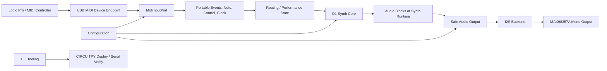
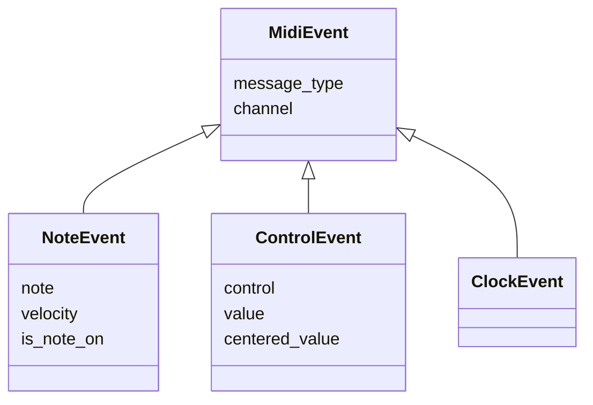
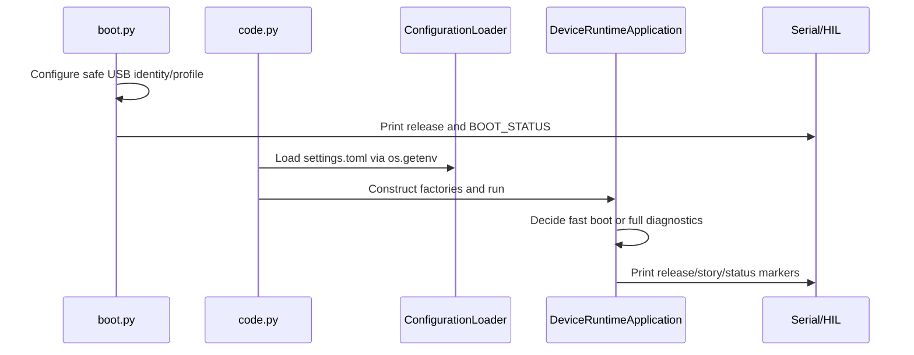
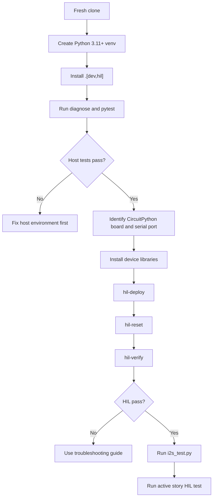

# Emergency Disaster Recovery Handbook

Document: `EMERGENCY_DISASTER_RECOVERY.md`  
Repository: `pappavis/circuitpython-midi-chip-platform`  
Assessed local path: `/Volumes/data1/Yandex.Disk.localized/michiele/Programmering/Python/python_normaal/github_python_normaal/circuitpython-midi-chip-platform-governance`  
Current release metadata observed in repository: `v0.20.0`, `MCP-US-080`, `2026-07-23`  
Primary evidence: repository files only  
Document purpose: disaster recovery, business continuity, cold start recovery, engineering onboarding, long-term maintenance and technical audit  

> Recovery principle: if a fact is not supported by this repository, treat it as `UNKNOWN` until proven again by code, tests, HIL logs, hardware measurements or a new ADR.

## 1. Document Status

| Field | Value |
|---|---|
| Status | Initial disaster recovery baseline |
| Intended owner | Release/Documentation plus Chief Enterprise Architect |
| Review status | Requires Product Owner and technical review before release certification |
| Evidence source | Repository contents, tests, docs and current git state |
| Last known commit at creation | `146fce5 feat(us080): add usb midi routing diagnostic` |
| Known limitation | The handbook is generated from repository evidence; it cannot certify external facts not present in Git |

This handbook is not a marketing README. It is the single source of truth for recovering this project if the original author, chat history, external tooling and institutional knowledge are unavailable. It must remain in the repository and be updated whenever architecture, deployment, configuration, risks, release procedure or recovery procedure changes.

## 2. Purpose

The purpose of this handbook is to enable an experienced software engineer who has never seen the project to:

- recover the repository from a cold clone;
- understand what the software does and does not do;
- rebuild the host development environment;
- deploy the CircuitPython device package to `CIRCUITPY`;
- validate hardware-in-the-loop behavior;
- identify current MVP blockers;
- maintain the project without relying on prior chat history;
- continue development under the repository governance rules.

The handbook assumes there is no internet, no Jira, no Azure DevOps, no Teams, no SharePoint, no Wiki, no Copilot history and no access to the original developer. The repository is the only reliable evidence source.

## 3. Executive Summary

`circuitpython-midi-chip-platform` is a CircuitPython-oriented retro synthesizer platform. Its near-term MVP is deliberately narrow: prove that a LOLIN/Wemos ESP32-S2 Mini running CircuitPython can receive USB-MIDI from Logic Pro, route MIDI events into a D1-style basic synth core, and produce audible mono I2S audio through a MAX98357A amplifier module. The longer-term product vision includes multi-core retro chip emulation such as D1, SN76489, SID 6581 and OPL2/OPL3, plus BLE-MIDI, external USB host scenarios, web control, local sequencer functions, stereo output, DSP and physical chip backends.

The repository has strong engineering discipline for an MVP-stage embedded project. It contains class-based architecture rules, an enforced no-globals policy, portable event models, host tests, HIL deployment tooling, risk documentation, ADRs, story reviews, burn-in policy and a detailed backlog. At the time this handbook was created, host tests passed with `162 passed`, and release metadata in `pyproject.toml` plus `src/midi_chip_platform/release.py` indicates version `0.20.0`.

The most important unresolved issue is the `MCP-US-055` P0 impediment: Logic Pro to audible D1 synth on the S2 is not yet accepted. Multiple diagnostics show that basic I2S output can be audible and USB-MIDI receive can work, but audible real-time synth playback from Logic has shown delayed behavior. `MCP-US-080` was added as a MIDI-only routing diagnostic to determine whether events arrive late from Logic/CoreMIDI or whether the delay is introduced after receive in the audio path.

Recovery is feasible but not trivial. A new engineer can run host tests quickly. Full recovery requires CircuitPython knowledge, a compatible board, `adafruit_midi`, a serial/REPL workflow, MAX98357A wiring, Logic or an equivalent USB-MIDI source, and careful separation of host tests from physical audio claims.

## 4. Business Context

The long-term product definition, as recorded in `docs/mvp_scope_v0.1.0.md`, is a MIDI-controlled, multi-core retro synthesizer module in pedal form. The product targets music/guitar/synth enthusiasts and should eventually operate without a DAW through USB-MIDI hosts, external controllers or other transports. The immediate MVP is not the full pedal. It is a proof that a reference board can behave as a usable external MIDI synth in Logic Pro and produce audible D1-style sound through the default I2S audio module.

Business-critical outcome for the current MVP:

1. Safe boot and USB-MIDI enumeration.
2. Board capability discovery and configuration boundary.
3. Independent I2S audio preflight using `device/i2s_test.py`.
4. D1 core host validation.
5. USB-MIDI receive from Logic or another host.
6. Audible D1 output through the MAX98357A.
7. HIL evidence and burn-in before MVP acceptance.

Anything beyond that, including SN76489, SID, OPL, web UI, BLE, stereo, DSP and physical chip backends, is post-MVP unless explicitly reclassified in the backlog.

## 5. Repository Overview

High-level repository structure:

```text
.
|-- README.md
|-- AGENTS.md
|-- pyproject.toml
|-- EMERGENCY_DISASTER_RECOVERY.md
|-- src/midi_chip_platform/
|-- device/
|-- tests/
|-- docs/
|-- docs/decisions/
|-- docs/framework_engineering/
|-- docs/incidents/
|-- docs/external_review_packets/
|-- assets/images/
|-- outputs/
```

Key repository roles:

| Area | Purpose | Evidence |
|---|---|---|
| `src/midi_chip_platform` | Host-safe Python package, domain model, ports, runtime factories, HIL tooling | `src/midi_chip_platform/*.py` |
| `device` | CircuitPython deployable entrypoints and hardware diagnostics | `device/boot.py`, `device/code.py`, `device/i2s_test.py` |
| `tests` | Host tests, AST governance tests, HIL tooling tests and runtime contract tests | `tests/test_*.py` |
| `docs` | MVP scope, user stories, reviews, risks, lessons learned and operational procedures | `docs/*.md` |
| `docs/decisions` | Architecture decision records | `ADR-001` to `ADR-004` |
| `docs/framework_engineering` | Governance, architecture, quality, glossary and context loading | `docs/framework_engineering/*.md` |
| `outputs` | Generated Kanban and audit artifacts | `outputs/CHATOD-20260714-MCP-CP-MVP-001/*` |

The package is declared in `pyproject.toml` as `circuitpython-midi-chip-platform`, with optional dependencies `dev` and `hil`.

## 6. Architecture Overview

The architecture is port/adaptor oriented and strongly class-based. The governance file `AGENTS.md` forbids global runtime state, global variables, module-level helper functions and import-time hardware side effects. `tests/test_architecture.py` enforces these rules using AST checks.

Conceptual architecture:



Important components:

| Component | Responsibility | Evidence |
|---|---|---|
| `MidiInputPort` | Abstract receive/open/close contract | `src/midi_chip_platform/ports.py` |
| `NoteEvent`, `ControlEvent`, `ClockEvent` | Portable MIDI-domain events | `src/midi_chip_platform/events.py` |
| `CircuitPythonUsbMidiFactory` | Creates USB-MIDI input adapters | `src/midi_chip_platform/midi_usb.py` |
| `D1SynthCore` | Portable D1-like waveform core | `src/midi_chip_platform/d1_core.py` |
| `SafeAudioOutput` | Startup mute and bounded gain decorator | `src/midi_chip_platform/audio.py` |
| `I2sDiagnosticApplication` | Independent physical I2S G-C-D test | `device/i2s_test.py` |
| `DeviceRuntimeApplication` | CircuitPython composition root | `src/midi_chip_platform/device_runtime.py` |
| `HardwareInLoopDeployer` | Dependency-closed deploy to CIRCUITPY | `src/midi_chip_platform/hil.py` |
| `MidiRoutingDiagnosticRuntime` | MCP-US-080 MIDI-only routing/timing diagnostic | `src/midi_chip_platform/midi_routing_diagnostic.py` |

`device/boot.py` is intentionally small. It configures safe USB behavior and reports boot metadata. Runtime logic belongs in `device/code.py` and the injected classes.

## 7. Technology Stack

| Layer | Technology | Evidence |
|---|---|---|
| Host language | Python 3.11+ | `pyproject.toml` |
| Packaging | setuptools build backend | `pyproject.toml` |
| Tests | pytest | `pyproject.toml`, `tests/` |
| HIL serial | pyserial optional dependency | `pyproject.toml`, `src/midi_chip_platform/hil.py` |
| Device runtime | CircuitPython 10.x target | docs and HIL logs in repository |
| MIDI library | `adafruit_midi` required on device | `device/requirements.txt`, `hil.py` |
| Audio backend | `audiobusio.I2SOut`, MAX98357A mono default | `device/i2s_test.py`, `i2s_audio.py`, `mvp_scope` |
| Synth experiment | `synthio` baseline | `src/midi_chip_platform/synthio_runtime.py` |
| DAW acceptance target | Logic Pro external MIDI | `docs/mcp_us_055_logic_d1_i2s_review_v0.1.0.md` |

There is no evidence of Docker, Makefile, GitHub Actions or other CI/CD configuration in the repository file list at this assessment point.

## 8. Directory Structure

```text
src/midi_chip_platform/
  application.py              Host application skeleton
  audio.py                    Audio blocks, safety profile and safe output
  ble_midi.py                 BLE capability gate, not radio startup
  cli.py                      Host diagnostics and HIL commands
  configuration.py            Public defaults and CircuitPython settings boundary
  core.py                     SynthCore interface and registry concepts
  d1_core.py                  Portable D1 waveform core
  d1_runtime.py               D1 USB-MIDI/I2S runtime path
  device_runtime.py           Device composition root
  events.py                   Portable MIDI event model
  hil.py                      Deploy, verify, reset and dependency closure
  i2s_audio.py                CircuitPython I2S output adapter
  midi_usb.py                 USB-MIDI translation and diagnostics
  midi_routing_diagnostic.py  MCP-US-080 MIDI-only routing diagnostic
  realtime_baseline.py        Raw I2S baseline spike
  synthio_runtime.py          Persistent synthio graph spike
  release.py                  Runtime release banner
  ports.py                    Interfaces
  testing.py                  Host fakes

device/
  boot.py                     CircuitPython boot entrypoint
  code.py                     CircuitPython runtime entrypoint
  i2s_test.py                 Independent audible I2S diagnostic
  settings.toml.example       Public configuration template
  requirements.txt            Device library requirements

tests/
  test_architecture.py        Governance and import-safety
  test_hil.py                 HIL deploy/verify behavior
  test_*                      Domain, MIDI, audio, runtime and CLI tests

docs/
  decisions/                  ADRs
  framework_engineering/      Governance and architecture
  incidents/                  P0 incident reviews
  external_review_packets/    External review handoff packet
```

## 9. Build Process

Cold host build:

```bash
python3 -m venv .venv
source .venv/bin/activate
python -m pip install --upgrade pip
python -m pip install -e ".[dev,hil]"
python -m midi_chip_platform diagnose
python -m pytest -q
```

Windows equivalent:

```powershell
py -3.11 -m venv .venv
.\.venv\Scripts\Activate.ps1
python -m pip install --upgrade pip
python -m pip install -e ".[dev,hil]"
python -m midi_chip_platform diagnose
python -m pytest -q
```

Expected current host test result at creation time:

```text
162 passed
```

The test count will change as the repository evolves. Treat a lower test count as a warning unless explained by an intentional test deletion.

## 10. Configuration

Configuration is class-based and loaded from:

1. public defaults in `ConfigurationDefaults`;
2. private CircuitPython `settings.toml` values through `os.getenv`;
3. future runtime overrides where applicable.

Key default areas:

| Area | Example keys | Evidence |
|---|---|---|
| Audio | `audio.backend`, `audio.i2s.bit_clock`, `audio.master_gain` | `configuration.py` |
| D1 runtime | `synth.d1.enabled`, `synth.d1.fast_boot_mode`, `synth.d1.waveform` | `configuration.py` |
| Realtime baseline | `realtime_baseline.*` | `configuration.py`, `realtime_baseline.py` |
| Synthio baseline | `synthio_baseline.*` | `configuration.py`, `synthio_runtime.py` |
| MIDI diagnostic | `midi.diagnostic.*` | `configuration.py`, `midi_usb.py` |
| MIDI routing diagnostic | `midi.routing_diagnostic.*` | `configuration.py`, `midi_routing_diagnostic.py` |
| Wi-Fi future boundary | `wifi.mode`, `wifi.ssid`, `wifi.password` | `configuration.py` |

`device/settings.toml.example` is a template. A real `settings.toml` must not be committed.

## 11. Environment Variables

CircuitPython reads configuration through `os.getenv`. The public template uses names such as:

| Environment/settings key | Purpose |
|---|---|
| `AUDIO_BACKEND` | Select audio backend profile |
| `I2S_BIT_CLOCK`, `I2S_WORD_SELECT`, `I2S_DATA` | I2S pin names |
| `AUDIO_MASTER_GAIN`, `AUDIO_MAXIMUM_MASTER_GAIN` | Digital gain boundary |
| `D1_RUNTIME_ENABLED`, `D1_FAST_BOOT_MODE` | D1 runtime startup |
| `REALTIME_BASELINE_ENABLED` | Raw I2S realtime baseline |
| `SYNTHIO_BASELINE_ENABLED` | Persistent synthio graph baseline |
| `MIDI_ROUTING_DIAGNOSTIC_ENABLED` | MIDI-only routing diagnostic |
| `MIDI_DIAGNOSTIC_ENABLED` | Bounded Note On/Off diagnostic |
| `WIFI_SSID`, `WIFI_PASSWORD`, `WEB_AP_PASSWORD` | Private future network values |

Secret-like values are redacted in status output as `SET` or `UNSET`. This is not encryption. A historical Wi-Fi credential exposure is recorded as an open human action in `docs/risk_register_v0.1.0.md`.

## 12. Dependencies

Host dependencies:

- Python `>=3.11`
- `pytest>=8,<9` for development tests
- `pyserial>=3.5,<4` for HIL commands

Device dependencies:

- CircuitPython firmware compatible with the target board
- `adafruit_midi`, as declared in `device/requirements.txt`
- Built-in CircuitPython modules such as `usb_midi`, `audiobusio`, `board`, `supervisor`, `storage` depending on runtime path

No pinned `requirements.txt` exists for the host. Host dependencies are declared through `pyproject.toml`. Device dependency installation uses CircUp according to `docs/quickstart_installation_v0.1.0.md`.

## 13. Data Model

The core data model is the portable MIDI event model:



Evidence: `src/midi_chip_platform/events.py`, `tests/test_domain_events.py`.

Audio is represented through:

- `AudioStreamFormat`;
- `AudioBlock`;
- `AudioOutputPort`;
- safety profiles and wrappers.

Evidence: `src/midi_chip_platform/audio.py`, `tests/test_audio_output.py`, `tests/test_audio_safety.py`.

Synth cores implement class contracts rather than global state. Evidence: `src/midi_chip_platform/core.py`, `src/midi_chip_platform/d1_core.py`.

## 14. Application Lifecycle

CircuitPython startup:



`DeviceRuntimeApplication` selects the active runtime according to configuration. Precedence includes legacy MIDI diagnostic, MCP-US-080 routing diagnostic, synthio baseline, realtime baseline and D1 runtime. Evidence: `src/midi_chip_platform/device_runtime.py`.

## 15. End-to-End Data Flow

Intended MVP path:

```text
Logic Pro External MIDI
  -> ESP32-S2 USB MIDI endpoint
  -> adafruit_midi receive
  -> MidiMessageTranslator
  -> NoteEvent / ControlEvent / ClockEvent
  -> D1 runtime / D1 core
  -> audio block or persistent audio graph
  -> SafeAudioOutput / I2S adapter
  -> MAX98357A
  -> audible output
```

Current diagnostic split:

- `device/i2s_test.py`: proves I2S/MAX98357 independent of MIDI and synth package.
- `UsbMidiReceiveDiagnostic`: proves bounded Note On/Off receive.
- `RealtimeMidiAudioBaseline`: isolates raw I2S event tone behavior.
- `SynthioBaselineRuntime`: isolates persistent `synthio` graph behavior.
- `MidiRoutingDiagnosticRuntime`: isolates MIDI routing without any audio.

## 16. Business Rules

Repository-supported business rules:

| Rule | Evidence | Confidence |
|---|---|---|
| First MVP is Logic USB-MIDI to audible D1 on ESP32-S2 reference board | `docs/mvp_scope_v0.1.0.md` | High |
| SN76489, SID, OPL, web, BLE, stereo, DSP and multi-core are post-MVP | `docs/mvp_scope_v0.1.0.md`, `docs/user_stories_v0.1.0.md` | High |
| `python-d1-synth` is read-only reference | `AGENTS.md` | High |
| No globals or import side effects are allowed | `AGENTS.md`, `tests/test_architecture.py` | High |
| HIL claims require device evidence, not host tests only | `AGENTS.md`, `docs/agile_delivery_release_plan_v0.1.0.md` | High |
| Physical audio safety is not production-certified yet | `docs/risk_register_v0.1.0.md`, `docs/mvp_scope_v0.1.0.md` | High |

## 17. Validation Logic

Validation layers:

1. AST governance validation: no module-level runtime state, no globals, no import-side hardware effects.
2. Unit and contract tests: events, MIDI, audio, D1 core, configuration, runtime factories.
3. HIL deploy validation: manifest closure, hashes, device libraries.
4. HIL execution validation: release banner, boot marker, runtime markers.
5. Human HIL validation: audible sound, Logic routing, oscilloscope observations.
6. Burn-in validation: heap and long-run stability per spec.

Do not mark a story Done solely because tests pass if its acceptance criteria require human hardware evidence.

## 18. Logging Strategy

The project uses serial/console text markers rather than a structured logging framework. Markers are designed for HIL proof and Product Owner reporting.

Examples:

```text
circuitpython-midi-chip-platform v0.20.0 | story=MCP-US-080 | release-date=2026-07-23
DEVICE_FAST_BOOT_STATUS=ENABLED
MIDI_ROUTING_DIAGNOSTIC_INPUT_STATUS=OPEN
MIDI_ROUTING_EVENT=note_on;channel=1;note=69;velocity=99;event_ms=0
```

Logging must avoid secrets and raw private device identifiers. `hil.py` redacts private identifiers in CLI output. Docs warn that UID, MAC, SSID and credentials must not be published.

## 19. Error Handling

Error handling is implemented through:

- explicit `PASS`/`FAIL` status lines;
- typed validation in constructors;
- bounded diagnostic timeouts;
- HIL failure reasons such as `missing-source`, `manifest-open`, `device-unavailable`;
- cleanup in `finally` blocks for MIDI input and deploy autoreload sessions.

Known limitation: error handling is not centralized. Each runtime reports its own status. A new engineer should preserve these simple serial markers because they are part of the HIL evidence model.

## 20. Testing Strategy

Test categories:

| Category | Examples |
|---|---|
| Architecture/governance | `tests/test_architecture.py` |
| Domain events | `tests/test_domain_events.py` |
| MIDI receive/routing/performance | `test_usb_midi_receive.py`, `test_midi_routing.py`, `test_midi_performance.py` |
| Audio safety and output | `test_audio_output.py`, `test_audio_safety.py`, `test_i2s_audio_output.py` |
| D1 core/runtime | `test_d1_core.py`, `test_d1_usb_midi_runtime.py` |
| Device composition | `test_device_runtime.py` |
| HIL deploy/verify | `test_hil.py` |
| Baseline spikes | `test_realtime_baseline.py`, `test_synthio_runtime.py`, `test_midi_routing_diagnostic.py` |

Run:

```bash
python -m pytest -q
```

At creation time: `162 passed`.

## 21. CI/CD

Repository evidence for CI/CD automation: `UNKNOWN`.

The assessment found no visible GitHub Actions workflow, Dockerfile, Makefile or shell scripts in the repository file list. Build, test, deploy and verify are currently local CLI workflows. This is acceptable for an early embedded MVP but weak for disaster recovery and release governance.

Minimum future CI recommendation:

- run `python -m pytest -q` on push/PR;
- verify package metadata consistency;
- run secret scanning;
- lint Markdown links where practical;
- preserve HIL as manual or self-hosted runner job because physical hardware is required.

## 22. Release Process

Evidence-supported release behavior:

1. update release metadata in `src/midi_chip_platform/release.py`;
2. update `pyproject.toml` version;
3. update story/review docs;
4. run host tests;
5. deploy to `CIRCUITPY` with `hil-deploy`;
6. reset with `hil-reset`;
7. verify with `hil-verify`;
8. capture human HIL evidence where required;
9. commit and push.

There is no evidence of formal tags or GitHub Releases for the current MVP. Treat tag/release steps as `UNKNOWN` until implemented or documented.

## 23. Operational Runbooks

### Host Sanity Runbook

```bash
git status --short
python -m pip install -e ".[dev,hil]"
python -m midi_chip_platform diagnose
python -m pytest -q
```

Pass criteria:

- package imports without hardware;
- release banner matches `pyproject.toml`;
- tests pass.

### Device Deploy Runbook

1. Close Thonny and serial monitors.
2. Discover `CIRCUITPY` and serial port.
3. Ensure `adafruit_midi` is installed on the device.
4. Run:

```bash
python -m midi_chip_platform hil-deploy --source-root . --device-root <CIRCUITPY> --serial-port <PORT>
python -m midi_chip_platform hil-reset --serial-port <PORT>
python -m midi_chip_platform hil-verify --source-root . --device-root <CIRCUITPY> --serial-port <PORT>
```

Expected HIL verify categories:

- connection: PASS
- manifest-closure: PASS
- deployment: PASS
- device-libraries: PASS
- boot: PASS
- execution: PASS

### Independent I2S Runbook

Use `device/i2s_test.py` from the CircuitPython REPL:

```python
from i2s_test import I2sDiagnosticApplication
I2sDiagnosticApplication().run()
```

Expected result: G-C-D square-wave sequence and `I2S_DIAGNOSTIC_STATUS=PASS`.

## 24. Troubleshooting Guide

| Symptom | Likely cause | Action |
|---|---|---|
| `No module named midi_chip_platform` | editable install missing or wrong directory | activate venv, reinstall `-e ".[dev,hil]"` |
| `device-libraries: FAIL - missing: adafruit_midi` | CircuitPython library absent | install `adafruit_midi` with CircUp |
| `boot: FAIL`, `execution: PASS` | stale `boot_out.txt` | run `hil-reset`, then `hil-verify` |
| CIRCUITPY not writable | media mounted read-only or busy | close tools, power-cycle, do not format without explicit recovery decision |
| No I2S sound | wiring, power, amplifier, wrong load or volume | run independent `i2s_test.py`; verify IO5/IO3/IO7, GND and power |
| MIDI events not visible | wrong Logic destination, serial conflict, endpoint issue | run MCP-US-080 routing diagnostic |
| MIDI events visible but sound delayed | audio path/runtime primitive issue | inspect MCP-US-079/US-055 audio graph |
| Secret appears in logs | governance breach | stop, rotate secret, scrub logs before publication |

## 25. Cold Start Recovery

Cold recovery procedure:



Do not start feature work until host tests and basic HIL verification pass.

## 26. Disaster Recovery Procedure

### Before Recovery

- [ ] Identify the intended repository remote and branch.
- [ ] Confirm no private device backup is being restored into Git.
- [ ] Confirm hardware is safe to power.
- [ ] Confirm the Python interpreter is 3.11+ and not `/usr/bin/python` 2.7.
- [ ] Confirm only one serial client will own the board.

### During Recovery

- [ ] Clone repository.
- [ ] Read `AGENTS.md`, `README.md`, `docs/mvp_scope_v0.1.0.md`, `docs/user_stories_v0.1.0.md`.
- [ ] Install host environment.
- [ ] Run all host tests.
- [ ] Install CircuitPython libraries.
- [ ] Deploy and verify.
- [ ] Run independent I2S diagnostic.
- [ ] Run active impediment diagnostic.

### After Recovery

- [ ] Record commit hash.
- [ ] Record test output.
- [ ] Record HIL output with private IDs redacted.
- [ ] Update unknown/risk registers if new facts appear.
- [ ] Do not mark MVP accepted until Product Owner accepts Logic-to-audible-D1.

## 27. Knowledge Transfer Guide

New engineer reading order:

1. `AGENTS.md`
2. `README.md`
3. `docs/mvp_scope_v0.1.0.md`
4. `docs/framework_engineering/architecture_v0.1.0.md`
5. `docs/user_stories_v0.1.0.md`
6. `docs/risk_register_v0.1.0.md`
7. `docs/decisions/*.md`
8. active story review, currently `docs/mcp_us_080_usb_midi_routing_diagnostic_review_v0.1.0.md`
9. `src/midi_chip_platform/device_runtime.py`
10. `src/midi_chip_platform/hil.py`

Minimum concepts to understand:

- why `boot.py` must stay minimal;
- why `i2s_test.py` is independent;
- why host tests do not prove audible hardware behavior;
- why the D1 desktop project is read-only reference;
- why secrets must remain outside Git;
- why current work is blocked on US-055/US-080 evidence.

## 28. Developer Onboarding

Onboarding checklist:

- [ ] Python 3.11+ confirmed.
- [ ] `.venv` created and activated.
- [ ] `python -m pip install -e ".[dev,hil]"` completed.
- [ ] `python -m pytest -q` passes.
- [ ] `python -m midi_chip_platform diagnose` reports host skeleton ready.
- [ ] `AGENTS.md` no-globals rule understood.
- [ ] Active story and dependencies identified.
- [ ] HIL hardware and serial ownership rules understood.
- [ ] No changes made to `python-d1-synth`.

## 29. Maintenance Guide

When changing code:

1. identify the active story;
2. update or add tests first where possible;
3. preserve class-based architecture;
4. update headers in modified `.py` files;
5. update configuration docs if keys change;
6. update HIL manifest if deployable modules change;
7. run tests;
8. run HIL if hardware behavior changes;
9. update story review and risk/unknown registers;
10. commit with story ID.

Do not edit device files directly on `CIRCUITPY` as the only source. The repository remains the source of truth.

## 30. Known Risks

Highest risks:

| Risk | Current status | Evidence |
|---|---|---|
| Exposed historical Wi-Fi credential must be rotated | Open human action | `docs/risk_register_v0.1.0.md` |
| Logic realtime audio not accepted | P0 impediment | `docs/user_stories_v0.1.0.md`, `docs/mcp_us_055_logic_d1_i2s_review_v0.1.0.md` |
| MAX98357 prototype load safety | PO exception only | `docs/risk_register_v0.1.0.md`, `docs/mcp_us_075_safe_audio_gate_review_v0.1.0.md` |
| No CI/CD automation | Unknown/absent | repository file inventory |
| Documentation drift | Present | `README.md` status vs `pyproject.toml`/`release.py` |
| Physical chip expansion risk | Post-MVP | `docs/physical_chip_display_expansion_amendment_v0.1.0.md` |

## 31. Technical Debt

| Debt | Impact | Recommended action |
|---|---|---|
| README release status drift | Misleads recovery engineer | Update README to v0.20.0 and active US-080 status |
| No CI workflows | Regression risk after clone/push | Add basic GitHub Actions for host tests |
| Multiple baseline runtimes | Cognitive load | Keep until US-055 resolved, then retire failed spikes |
| No formal release tag procedure | Audit weakness | Add release checklist and tagging runbook |
| Device settings are manual | HIL repeatability risk | Add documented settings profiles per diagnostic |
| Current MVP P0 blocker unresolved | Product cannot be accepted | Complete MCP-US-080 HIL test and decide next architecture move |

## 32. Open Questions

| ID | Question | Impact | Status |
|---|---|---|---|
| U-001 | Do Logic/CoreMIDI events arrive late or does audio delay after receive? | Blocks US-055 | Open, MCP-US-080 active |
| U-002 | Is `synthio` viable for the ESP32-S2 real-time path? | May require architecture change | Open |
| U-003 | What final speaker/headphone/pedal-safe output circuit will be used? | Hardware safety | Open/Post-MVP |
| U-004 | Has the historical Wi-Fi credential been rotated? | Security | UNKNOWN |
| U-005 | Is Windows USB-MIDI acceptance proven? | Portability | UNKNOWN/Post-MVP |
| U-006 | Is an 8-hour MVP burn-in complete? | Release readiness | UNKNOWN/Open |
| U-007 | Are release tags/GitHub releases used? | Recoverability | UNKNOWN |

## 33. Future Improvements

- Add CI for host tests and architecture tests.
- Add a generated release evidence bundle.
- Add settings profile files for common HIL modes.
- Add link checker for docs.
- Add pre-commit secret scanning.
- Add a formal recovery drill once US-055 is accepted.
- Add stable USB instance naming story implementation.
- Add second-board validation before broad CircuitPython support claims.

## 34. Glossary

| Term | Meaning |
|---|---|
| HIL | Hardware-in-the-loop: physical device deploy and verification |
| CIRCUITPY | USB mass storage volume exposed by CircuitPython |
| D1 core | Portable basic synth core inspired by D1-style subtractive synth direction |
| MAX98357A | Mono I2S class-D amplifier used for first audio output |
| US-055 | MVP Logic Pro audible D1 acceptance story |
| US-080 | MIDI-only routing diagnostic to isolate Logic/CoreMIDI timing |
| PO | Product Owner |
| ADR | Architecture Decision Record |
| SSOT | Single Source of Truth |

## 35. Appendices

### Appendix A: Key Commands

```bash
python -m midi_chip_platform diagnose
python -m midi_chip_platform events-diagnose
python -m pytest -q
python -m midi_chip_platform hil-deploy --source-root . --device-root <CIRCUITPY> --serial-port <PORT>
python -m midi_chip_platform hil-reset --serial-port <PORT>
python -m midi_chip_platform hil-verify --source-root . --device-root <CIRCUITPY> --serial-port <PORT>
```

### Appendix B: MCP-US-080 Device Settings

```toml
MIDI_DIAGNOSTIC_ENABLED = "false"
REALTIME_BASELINE_ENABLED = "false"
SYNTHIO_BASELINE_ENABLED = "false"
MIDI_ROUTING_DIAGNOSTIC_ENABLED = "true"
MIDI_ROUTING_DIAGNOSTIC_SCAN_ALL_PORTS = "true"
MIDI_ROUTING_DIAGNOSTIC_MAX_EVENTS = 32
MIDI_ROUTING_DIAGNOSTIC_TIMEOUT_SECONDS = "120.0"
MIDI_ROUTING_DIAGNOSTIC_IDLE_SLEEP_SECONDS = "0.001"
MIDI_ROUTING_DIAGNOSTIC_EVENT_LOGGING = "summary"
MIDI_ROUTING_DIAGNOSTIC_HEARTBEAT_SECONDS = "2.0"
```

## 36. Repository Evidence Matrix

| Statement | Evidence | Confidence |
|---|---|---|
| Project package version is 0.20.0 | `pyproject.toml`, `src/midi_chip_platform/release.py` | High |
| Host tests currently pass at 162 tests | observed local test run; `tests/` | High for current run |
| Architecture forbids globals and import side effects | `AGENTS.md`, `tests/test_architecture.py` | High |
| Device deployment is manifest-based | `src/midi_chip_platform/hil.py` | High |
| `adafruit_midi` is required on device | `device/requirements.txt`, `hil.py` | High |
| MVP is not accepted yet | `docs/user_stories_v0.1.0.md`, US-055 P0 status | High |
| No CI/CD exists | repository file search found no workflow/config | Medium |
| Wi-Fi credential rotation remains human action | `docs/risk_register_v0.1.0.md` | High |
| README status is stale | `README.md` vs `pyproject.toml` | High |

## 37. Source Traceability Matrix

| Claim | Evidence | Confidence |
|---|---|---|
| Safe boot must stay minimal | `AGENTS.md`, `device/boot.py`, `docs/mcp_us_003_safe_boot_review_v0.1.0.md` | 95% |
| I2S diagnostic is independent from synth runtime | `device/i2s_test.py`, `docs/mvp_scope_v0.1.0.md` | 95% |
| HIL verify validates boot and execution markers | `src/midi_chip_platform/hil.py`, `tests/test_hil.py` | 95% |
| D1 core supports sine/saw/square diagnostics | `src/midi_chip_platform/d1_core.py`, `tests/test_d1_core.py`, `tests/test_cli.py` | 90% |
| US-080 isolates MIDI from audio path | `midi_routing_diagnostic.py`, `docs/mcp_us_080_usb_midi_routing_diagnostic_review_v0.1.0.md` | 95% |
| Full pedal product is future vision | `README.md`, `docs/mvp_scope_v0.1.0.md` | 90% |
| Production hardware safety is not certified | `docs/risk_register_v0.1.0.md` | 95% |

## 38. Repository Maturity Assessment

| Dimension | Score | Justification |
|---|---:|---|
| Architecture | 8/10 | Clear ports, composition root, ADRs and AST enforcement |
| Documentation | 7/10 | Extensive docs, but drift and no DR handbook before this file |
| Testing | 8/10 | 162 host tests and HIL tooling; no CI |
| Security | 5/10 | Secret boundary exists, but historical credential rotation is open |
| Maintainability | 7/10 | Strong rules; many diagnostic runtimes add complexity |
| Reliability | 5/10 | Basic HIL works; US-055 real-time path unresolved |
| Recoverability | 7/10 | HIL deploy/verify strong; cold-start handbook now added |
| Operational readiness | 4/10 | MVP not accepted; no formal release/burn-in completion |
| Automation | 5/10 | CLI automation exists; CI absent |
| Overall grade | 6.5/10 | Strong engineering prototype, not yet accepted product |

## 39. Unknown Register

| ID | Description | Impact | Priority | Reason | Recommended Action | Status |
|---|---|---|---|---|---|---|
| U-001 | Logic/CoreMIDI vs audio-path cause of audible delay | Blocks MVP | P0 | US-055 unresolved | Complete MCP-US-080 HIL test | Open |
| U-002 | Credential rotation completion | Security risk | P0 | Repository cannot prove human action | PO confirms rotation outside repo | Open |
| U-003 | CI/CD existence outside repo | Recovery risk | P2 | No repo evidence | Treat as absent until added | Open |
| U-004 | 8-hour burn-in completion | Release risk | P0 | No final report found | Run and document burn-in | Open |
| U-005 | Windows acceptance | Portability risk | P3 | Post-MVP story | Execute later story | Open |
| U-006 | Final safe audio hardware design | Safety risk | P1 | Prototype exception only | Complete US-076/post-MVP hardware work | Open |

## 40. Assumption Register

| ID | Assumption | Class | Rationale | Validation |
|---|---|---|---|---|
| A-001 | `origin/main` at `146fce5` is the intended recovery point | Medium Risk | Current local and remote state observed | Confirm with git remote/log during recovery |
| A-002 | The reference board remains LOLIN/Wemos ESP32-S2 Mini | Medium Risk | MVP docs state this | Confirm board ID at HIL |
| A-003 | MAX98357A wiring uses IO5 BCLK, IO3 WS, IO7 DATA | Medium Risk | MVP/config/docs state this | Confirm physical wiring and i2s test |
| A-004 | Logic Pro remains primary DAW acceptance target | Low Risk | Multiple docs state this | Confirm with PO |
| A-005 | No external docs are available | Blocking | Disaster prompt requires repo-only recovery | Use UNKNOWN for missing facts |

## 41. Risk Register

| Risk | Probability | Impact | Mitigation | Owner | Priority |
|---|---|---|---|---|---|
| US-055 real-time audio remains blocked | High | Critical | Complete MCP-US-080, then choose MIDI or audio fix path | Architect/Embedded/QA | P0 |
| Stale docs mislead recovery | Medium | High | Update README and recovery docs per release | Release/Docs | P1 |
| Historical secret not rotated | Unknown | Critical | Rotate outside repo, record non-secret confirmation | PO/Security | P0 |
| No CI allows regressions | Medium | Medium | Add host-test GitHub Actions | DevOps | P2 |
| HIL depends on local hardware | High | High | Document hardware and runbooks, keep independent i2s test | QA/HIL | P1 |
| Prototype audio load unsafe | Medium | Critical | No production claim; complete hardware safety story | Hardware/PO | P1 |
| Multiple diagnostic runtimes confuse operators | Medium | Medium | Provide settings profiles and active-story runbooks | Release/Docs | P2 |

## 42. Bus Factor Analysis

Current bus factor risk is medium-high. The repository captures extensive information, but the project still depends on specialized embedded/MIDI/audio knowledge and the Product Owner's physical hardware validation.

Single points of failure:

- Product Owner hardware setup and Logic Pro observations.
- Knowledge of current P0 latency history.
- Device wiring and safe audio load practices.
- Manual HIL process and serial ownership discipline.
- Security action outside repository for credential rotation.

Mitigations already present:

- detailed docs and story reviews;
- HIL deploy/verify automation;
- architecture tests;
- risk register;
- external review packets;
- this disaster recovery handbook.

Remaining mitigation:

- add reproducible release evidence bundles;
- add CI;
- add a concise active-incident dashboard;
- add photos/schematic for hardware wiring with safety notes.

## 43. Knowledge Capture Checklist

Use at every story close:

- [ ] New business rule documented.
- [ ] New configuration key documented.
- [ ] New dependency documented.
- [ ] New architecture decision documented or ADR updated.
- [ ] Recovery guide updated if operation changes.
- [ ] Tests updated.
- [ ] HIL evidence captured when applicable.
- [ ] Risks/unknowns updated.
- [ ] Lessons learned updated after 3-4 stories or serious impediment.
- [ ] Release metadata matches package version.
- [ ] No secrets or private IDs committed.

## 44. Recovery Validation Procedure

Recovery is successful only when:

1. Fresh clone works.
2. Host environment installs.
3. `python -m pytest -q` passes.
4. Device libraries are present.
5. `hil-deploy` passes.
6. `hil-reset` is requested.
7. `hil-verify` passes.
8. `device/i2s_test.py` is audible on the reference hardware.
9. Active story HIL test produces expected markers.
10. Known unknowns and blockers are acknowledged, not hidden.

## 45. AI Usage Policy

AI may assist with:

- summarizing repository evidence;
- drafting docs;
- generating tests and small code changes;
- comparing docs for drift;
- producing runbooks from verified code.

AI must not be trusted for:

- claims not supported by repository evidence;
- hardware safety certification;
- secret handling;
- final MVP acceptance;
- interpreting private logs without human review;
- changing read-only reference repositories.

Mandatory controls:

- repository-first evidence;
- human review for HIL and hardware claims;
- tests before code closure;
- UNKNOWN when evidence is absent;
- no secrets in prompts or generated docs.

## 46. Continuous Improvement Register

| Priority | Recommendation | Estimated Effort | Expected Benefit |
|---|---|---:|---|
| P0 | Complete MCP-US-080 HIL test and decide MIDI vs audio fault domain | 1-2 hours | Unblocks US-055 direction |
| P0 | Update README status to v0.20.0/US-080 | 30 minutes | Reduces recovery drift |
| P0 | Record secret rotation outcome without revealing secret | 15 minutes human action | Reduces security risk |
| P1 | Add CI host tests | 1-2 hours | Prevents basic regressions |
| P1 | Add release checklist and tag procedure | 1 hour | Improves auditability |
| P1 | Add settings profiles for diagnostics | 1-2 hours | Reduces HIL operator error |
| P2 | Add Markdown link check | 1 hour | Reduces doc drift |
| P2 | Add hardware wiring diagram/photo pack | 2-4 hours | Improves recovery of physical setup |

## 47. Disaster Recovery Checklist

### Before Recovery

- [ ] Confirm repository URL.
- [ ] Confirm branch/commit.
- [ ] Confirm no private backups will be committed.
- [ ] Confirm hardware safety.
- [ ] Confirm Python 3.11+.

### During Recovery

- [ ] Clone.
- [ ] Read `AGENTS.md`.
- [ ] Install host environment.
- [ ] Run tests.
- [ ] Install device libraries.
- [ ] Deploy.
- [ ] Reset.
- [ ] Verify.
- [ ] Run independent audio test.
- [ ] Run active diagnostic.

### After Recovery

- [ ] Record evidence.
- [ ] Redact private identifiers.
- [ ] Update unknowns.
- [ ] Update risks.
- [ ] Define next story action.

### Validation

- [ ] Host tests pass.
- [ ] HIL passes.
- [ ] Device runtime banner matches expected release.
- [ ] Active acceptance test executed.

### Operational Acceptance

- [ ] Product Owner accepts hardware result.
- [ ] Burn-in complete if required.
- [ ] Release docs updated.
- [ ] Tag/release created if applicable.

## 48. Engineering Decision Log

| Decision | Evidence |
|---|---|
| Use clean repository with controlled reuse | `docs/decisions/ADR-001-repository-strategy.md` |
| ESP32-S2 Mini is MVP reference platform | `docs/decisions/ADR-002-reference-platform.md` |
| Standalone I2S diagnostic before integrated synth | `docs/decisions/ADR-003-audio-strategy.md` |
| Use persistent realtime audio graph rather than per-event play/stop | `docs/decisions/ADR-004-persistent-realtime-audio-graph.md` |
| Use class-only/no-global architecture | `AGENTS.md`, `tests/test_architecture.py` |
| Treat MCP-US-080 as MIDI-only diagnostic | `docs/mcp_us_080_usb_midi_routing_diagnostic_review_v0.1.0.md` |

## 49. Lessons Learned

Visible lessons from the repository:

1. Host tests are necessary but insufficient for hardware audio claims.
2. Independent I2S diagnostics are critical before debugging integrated synth paths.
3. HIL deploy must be dependency-closed; missing deployed modules caused earlier impediments.
4. Serial/REPL ownership matters; Thonny and CLI tools can conflict.
5. Documentation can drift even in well-governed repositories; release state must be synchronized.
6. Secrets in prototypes become long-lived business risks unless rotated.
7. Repeated small patches to a failing real-time path should trigger architecture rebaseline.
8. Diagnostic runtimes are useful, but they must be clearly scoped and disabled when not active.
9. The backlog must protect MVP scope from attractive post-MVP synth features.
10. Recovery documentation should be created before institutional knowledge is lost, not after.

## 50. Final Certification Gate

Internal audit for this document:

| Gate | Status |
|---|---|
| Mandatory chapters included | PASS |
| Evidence policy applied | PASS |
| Unknowns explicitly registered | PASS |
| Assumptions classified | PASS |
| Risks registered | PASS |
| Recovery validation procedure included | PASS |
| AI usage policy included | PASS |
| No intentional placeholders | PASS |
| Remaining non-repository facts marked UNKNOWN | PASS |

This handbook is usable for cold-start recovery and onboarding, but it does not make the project MVP Accepted. That status remains blocked until the repository contains accepted evidence for Logic Pro USB-MIDI to audible D1 output on the reference board and required burn-in/release criteria.
