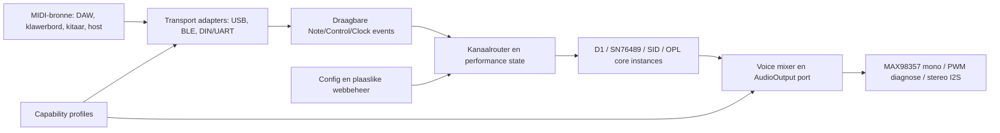

# Framework And Solution Architecture

<!--
Bestand: architecture_v0.1.0.md
Versienommer: 0.1.0
Doel: Beskryf framework-, solution-, runtime- en deployment-argitektuur met afdwingbare grense.
Sprint: Sprint 2
Epic: MCP-EPIC-009 Framework Engineering
User-Story: MCP-US-064 Enterprise Vision And Architecture Baseline
Actienr: MCP-ACT-064-ARCH-001
ChatID: CHATOD-20260714-MCP-CP-MVP-001 / FRAMEWORK-ENGINEERING-001
-->

## Argitektuurlense

| Lens | Fokus | Bron van waarheid |
|---|---|---|
| Enterprise | Waarde, vermoëns, rolle en portefeuljevolgorde | Visie, stories, RACI |
| Framework | Artefakte, gesag, review en agentkonteks | Hierdie pakket en `AGENTS.md` |
| Solution | Komponente, poorte en runtime-grense | ADR's, bronkode en kontraktoetse |
| Deployment | Host, CIRCUITPY, USB-MIDI, I2S en latere netwerk | HIL-runner en story-runbooks |

## Solution-konteks

## Verpligte poorte

| Poort | Verantwoordelikheid | Verbode kennis |
|---|---|---|
| `MidiInputPort` | Lewer genormaliseerde events | Synth core, audio device |
| Router | Kies kanaal/core instance | USB/BLE implementasiedetail |
| `SynthCore` | Verwerk events en lewer voices/samples | Fisiese I2S-penne |
| `AudioOutput` | Neem mono/stereo buffers of voices aan | MIDI-toestelnaam |
| Configuration | Lewer openbare en private waardes via instances | Hardgekodeerde secrets |
| Capability profile | Rapporteer module-, pen- en bordvermoë | Produkbesluit op grond van bordnaam alleen |

## Runtime-eienaarskap

`Application` besit die composition root. Dit konstrueer klasse en spuit afhanklikhede in. Elke veranderlike toestand, insluitend aktiewe note, routerbindings, buffers, netwerkstatus en diagnostiektellers, behoort aan 'n instansie. Modules definieer klasse maar begin geen diens tydens import nie. `boot.py` doen slegs vroeë USB/platform-opstelling; `code.py` skep die application binne 'n main guard.

## Deployment-topologie

| Omgewing | Rol | Mag bewys |
|---|---|---|
| macOS/Windows/Linux host | Eenheid-, kontrak-, AST- en simulasiestoetse | Semantiek en draagbaarheid sonder fisiese claim |
| `CIRCUITPY` volume | Dependency-geslote firmwaremanifest | Gedeployde bron en libraries |
| Serial/REPL | Boot-, uitvoering-, heap- en statusbewys | Werklike toestelgedrag, geredigeer |
| Logic/DAW/CoreMIDI | USB-MIDI-stimulus | Host-na-toestel transport |
| MAX98357/luidspreker/ossilloskoop | Hoorbare en meetbare klank | Fisiese audio-uitvoer |
| Latere Wi-Fi station/AP | Plaaslike beheer | Netwerk-UI, nie bootkritieke synthlogika nie |

## Cross-cutting kwaliteit

- **Portabiliteit:** capability gate plus tweede-bordbewys.
- **Sekuriteit:** private settings buite Git; AP met wagwoord; geen UID/MAC in openbare logs.
- **Prestasie:** begrensde polls, voorafbegrote buffers, heap/latency/dropout-telemetrie.
- **Herstelbaarheid:** CIRCUITPY bly bereikbaar; een serial-eienaar; atomiese deploy; safe boot.
- **Naspeurbaarheid:** story, ChatID, weergawe en release-datum in kodeheaders en startup.

## Evolusievolgorde

Platform en MIDI-kontrakte kom eerste; `AudioOutput` en MAX98357 maak die eerste hoorbare vertikale sny; die D1-core kom voor SN76489; webbeheer volg 'n kooperatiewe scheduler; multi-core en DSP volg eers nadat CPU/RAM/latency gemeet is. USB-instance-identiteit is release-polish en mag nie die hoorbare pad vooruitloop nie.

## Argitektuurfitness

Die AST-suite toets geen globals/modulefunksies/import-newe-effekte. Kontraktoetse toets poorte. HIL toets deploy, USB en audio. Backlog-sanity toets unieke stories en dekking. ADR-review is verpligtend wanneer 'n verandering 'n poort, bordstrategie, audio-backend, security boundary of releaseclaim verander.
