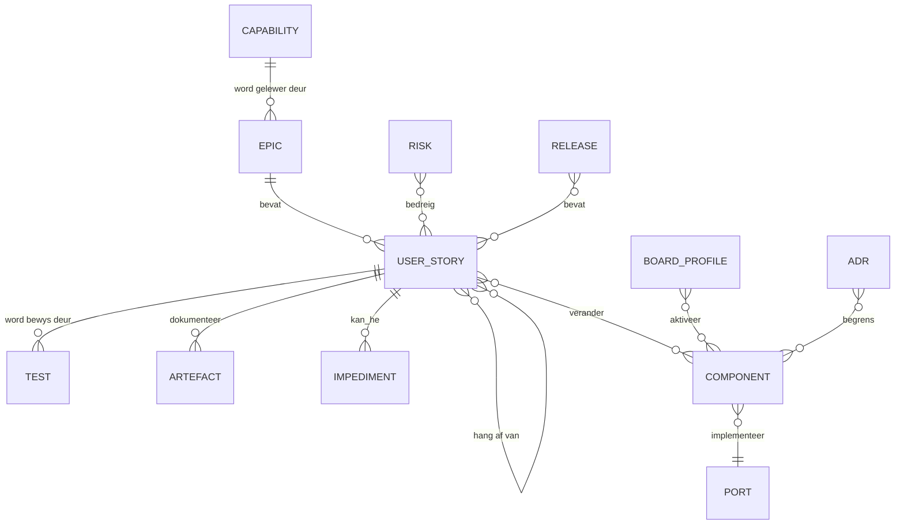

# Enterprise Meta Model

<!--
Bestand: enterprise_meta_model_v0.1.0.md
Versienommer: 0.1.0
Doel: Definieer projekentiteite, verhoudings, eienaarskap en bewyskettings.
Sprint: Sprint 2
Epic: MCP-EPIC-009 Framework Engineering
User-Story: MCP-US-065 Enterprise Meta Model, Glossary And Artefact Taxonomy
Actienr: MCP-ACT-065-META-001
ChatID: CHATOD-20260714-MCP-CP-MVP-001 / FRAMEWORK-ENGINEERING-001
-->

## Kernentiteite

| Entiteit | Unieke sleutel | Verpligte verhoudings | Eienaar |
|---|---|---|---|
| Produkdoel | Benoemde outcome | word gerealiseer deur capabilities | Product Owner |
| Capability | Naam | word gelewer deur een of meer epics | Chief Enterprise Architect |
| Epic | `MCP-EPIC-nnn` | bevat stories | Product Owner/Scrum Master |
| User story | `MCP-US-nnn` | het afhanklikheid, kriteria, status en bewys | BA/PO |
| Impediment | Story + volgnummer | blokkeer presies een aanvaardingskriterium | Scrum Master |
| Komponent | Pakket/klas/adapter | realiseer story en implementeer poort | Solution Architect |
| Poort | Kontraknaam | word geimplementeer deur adapters | Solution Architect |
| Bordprofiel | Profiel-ID | verklaar capabilities en penmapping | Embedded Engineer |
| Toets | Stabiele toetsnaam | verifieer 'n kriterium of fitness rule | QA |
| HIL-bewys | Story + commit + datum | bewys connection, deployment, execution en stimulus | QA/HIL |
| ADR | `ADR-nnn` | besluit oor 'n argitektuurkwessie | CEA/Solution Architect |
| Risiko | `R-nnn` | bedreig story, epic of release | PO/QA |
| Release | SemVer/tag | bevat slegs geverifieerde stories | Release Manager |
| Artefak | Pad + weergawe | ondersteun 'n entiteit en het metadata | Documentation |

## Verhoudingsreels

1. 'n Story is nie Done sonder minstens een aanvaardingsbewys nie.
2. 'n Fisiese claim benodig HIL; 'n hosttoets alleen is onvoldoende.
3. 'n ADR verander geen backlogstatus nie; dit stel slegs 'n besluit vas.
4. 'n Artefak kan baie stories ondersteun, maar moet een primêre eienaar hê.
5. 'n Release mag geen `In Review`, `Impediment` of ongetoetste Must-story as voltooi voorstel nie.
6. 'n Capability wat bordafhanklik is, verwys na 'n profiel en 'n positiewe of negatiewe gate.

## Naspeurbaarheidsketting

`Vision -> Capability -> Epic -> Story -> Criterion -> Test/HIL -> Commit -> Release`.

Die ketting is tweerigting: vanaf 'n release moet die gebruiker die bewys kan vind; vanaf 'n toets moet die span kan verduidelik watter kriterium en waarde dit beskerm.

## Geldigheidskontroles

- Story-ID's is uniek en aaneenlopend; tabelvolgorde bepaal uitvoeringsvolgorde.
- Elke impediment het oorsaak, bewys, herstel en retest.
- Elke Python-wysiging wys story, aksie, ChatID en weergawe.
- Private identiteite is nie modelentiteite in openbare dokumentasie nie; slegs geredigeerde aliases mag verskyn.
- Framework Engineering beskryf die model maar mag nie ontbrekende produkbewys skep nie.
